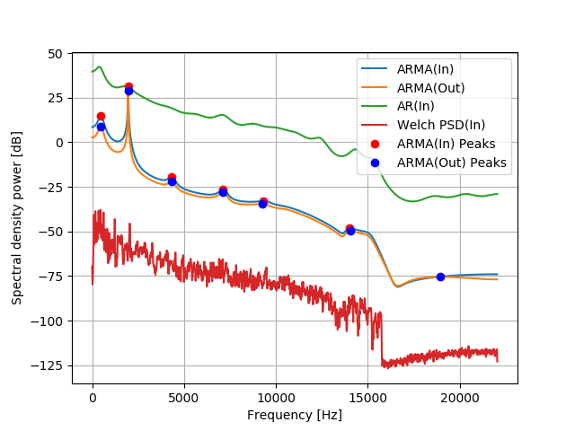

# Chebyshev polynomials expansion  

A trial numpy chebyshev polynomials expansion to fragment of music signal.  
A trial ARMA Spectral density power estimation.  

## contents 

- ola_convolve.py overlap-add convolve with impulse response waveform   
- chebyshev_expansion.py a trial numpy chebyshev polynomials expansion to the signal after apply impulse response  
- ARMA_Spectral_density.py a trial ARMA Spectral density power estimation. comparison with other ways.  

## Comparsion ARMA with other ways  

Following figure is ARMA Spectral density power estimation and other ways.  
  

  

 
